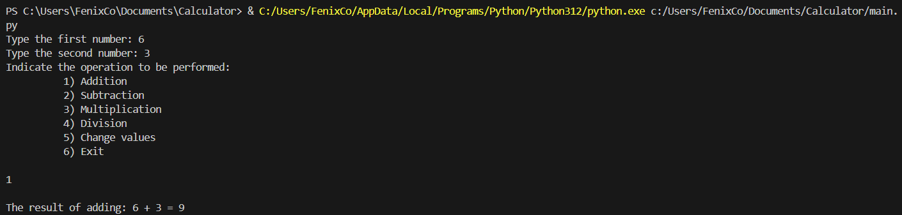

## Simple Calculator Made in Python

## Members

    Edwin Andres Duarte Rodriguez - 1152055
    edwinandresduro@ufps.edu.co

## Evidence
Get the first number.

Get the second number.

Choose the operation.

Show result.

Exit.

